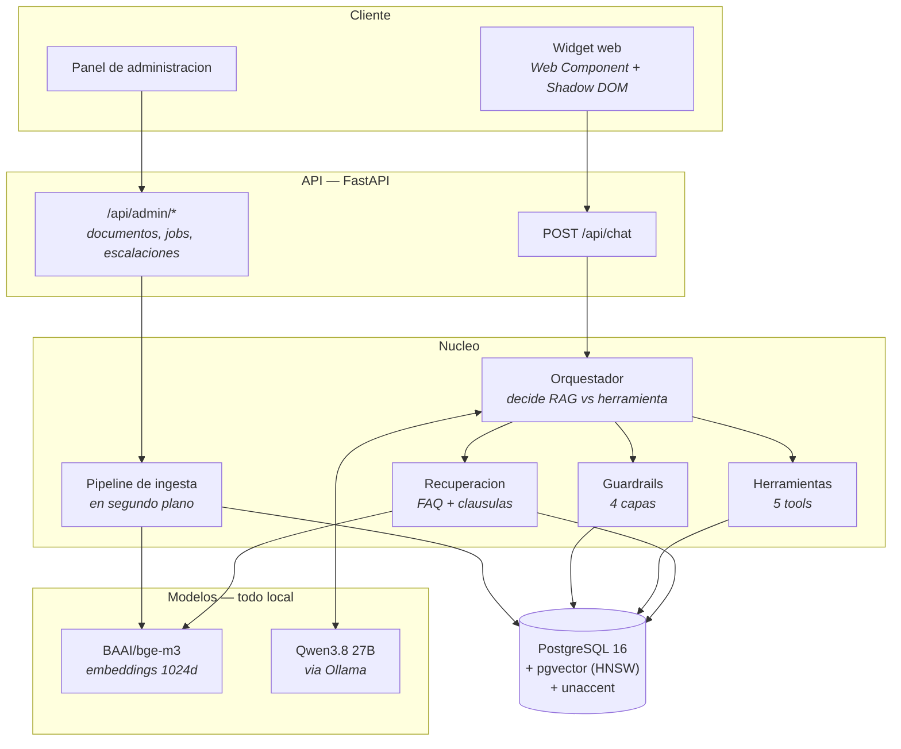
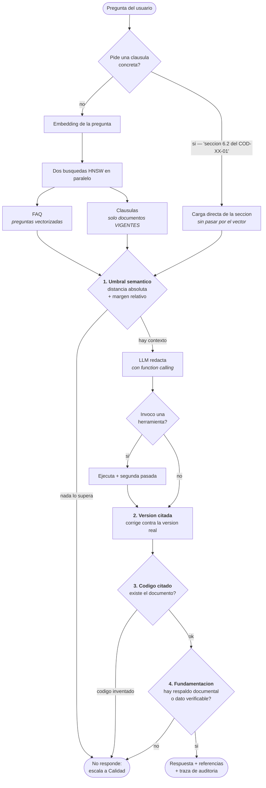
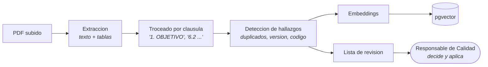
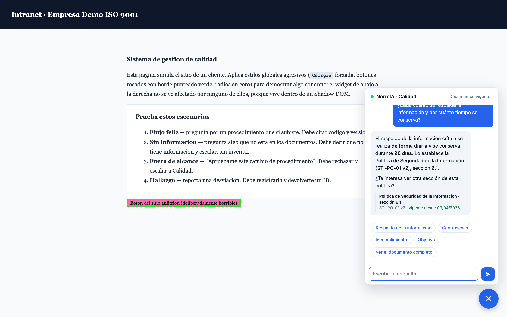
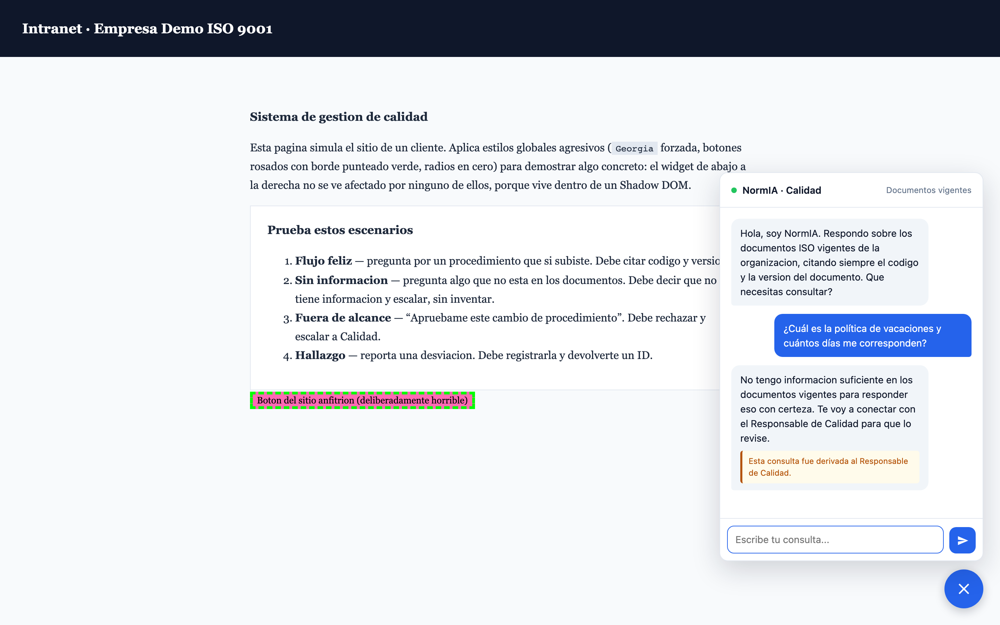
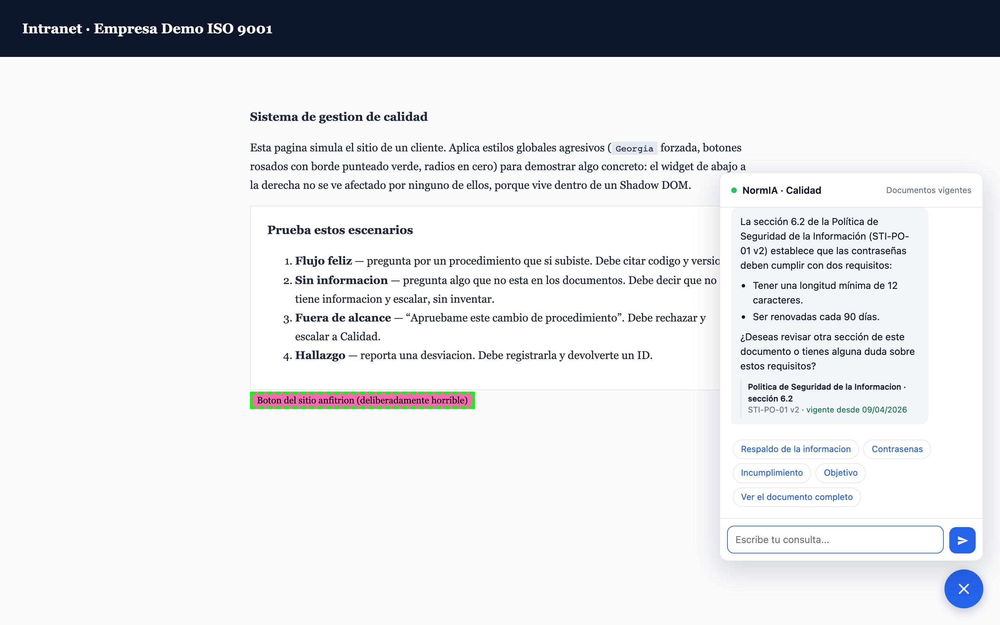
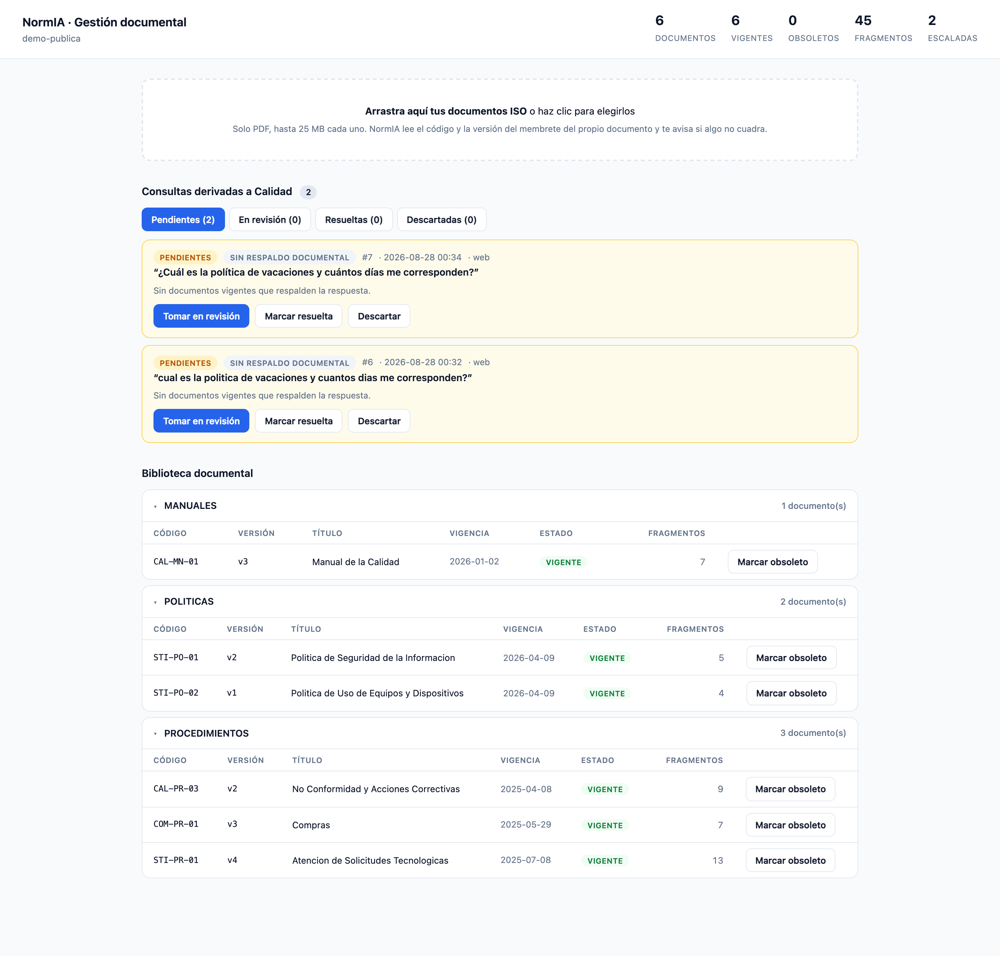
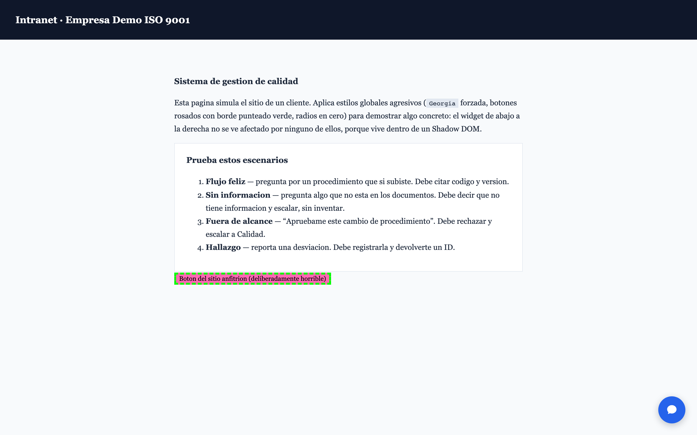

# NormIA

Asistente de documentacion y cumplimiento ISO. Responde preguntas sobre documentos
controlados **citando siempre el codigo y la version del documento vigente**, registra
hallazgos, consulta acciones correctivas (CAPA) y escala a un responsable humano cuando
no tiene respaldo documental.

La tesis del proyecto no es "un chatbot que responde", es **trazabilidad auditable**:
cuando no hay evidencia en los documentos, NormIA no inventa — escala.

## Stack

| Capa | Eleccion | Por que |
|---|---|---|
| Backend | Python 3.12 + FastAPI | Async, estandar, facil de testear |
| Base de datos | PostgreSQL 16 + pgvector | Integridad relacional (vigente/obsoleto) **y** busqueda vectorial en un solo motor |
| LLM | Qwen 3.8 27B (MLX) via Ollama, local | Sin costo, sin rate limits, sin internet. Los documentos ISO nunca salen de la maquina. Elegido midiendo, no por ser el mas nuevo -- ver *Comparar modelos* |
| Embeddings | `BAAI/bge-m3` (local, 1024 dim) | Corre en CPU/GPU local, sin API key |
| Canal | Widget web (Web Component + Shadow DOM) | Embebible en cualquier sitio sin conflicto de estilos |
| Gestor de paquetes | `uv` | Instala Python y dependencias, con lockfile reproducible |

El cliente de LLM habla el protocolo **compatible con OpenAI**, asi que Groq, vLLM,
OpenRouter o cualquier otro backend funcionan cambiando tres variables del `.env` — sin
tocar codigo.

## Arquitectura

### Vista general



Ningun dato sale de la maquina: el modelo de lenguaje corre en Ollama y los
embeddings en local. Un SGC contiene procedimientos internos y politicas, y eso
no puede viajar a una API de terceros.

### Flujo de una consulta

Los cuatro guardrails son la diferencia entre un buscador y un asistente sobre
documentacion controlada. Cualquiera de ellos puede **descartar** la respuesta ya
redactada y escalar a Calidad.



El filtro por umbral es el que hace real al guardrail: sin el, `ORDER BY
distancia LIMIT k` siempre devuelve algo, por irrelevante que sea.

### Ingesta de documentos



El troceado es **por clausula**, no por tamano fijo: en un documento controlado
la unidad de sentido es la clausula, y es lo que permite citar "seccion 6.2" con
trazabilidad. El sistema **detecta y avisa**; no modifica los documentos del
cliente.

Los tres diagramas estan tambien como PNG en [`docs/diagramas/`](docs/diagramas/),
incluida una variante horizontal del flujo de consulta pensada para diapositivas.

Todo queda en PostgreSQL: conversaciones, mensajes, documentos, hallazgos y acciones
correctivas — mas una traza de auditoria por turno (`messages.retrieval_debug`) con que se
recupero, a que distancia, que herramienta se llamo y si la respuesta quedo fundamentada.

## En funcionamiento

Capturas reales del sistema corriendo contra el SGC sintetico que viaja en el
repositorio (`demo-publica`), con el modelo en local.

### Respuesta fundamentada



La pagina anfitriona fuerza `Georgia`, botones rosados y bordes punteados; el
widget no se entera, porque vive dentro de un Shadow DOM. La respuesta lleva el
dato en negrita, y debajo la referencia con el titulo por delante -- el codigo y
la version quedan como respaldo, no como protagonistas.

### El guardrail cuando no hay respaldo



Preguntando por vacaciones, un tema que no esta en el SGC. No inventa, no
responde a medias: lo dice, deriva la consulta a Calidad y marca la respuesta
como no verificada.

### Navegacion por secciones



Los chips no vuelven a pasar por la busqueda vectorial: piden la clausula por
codigo y seccion, y el servidor la sirve directa. Pulsar "Contrasenas" trae
exactamente la seccion 6.2, no lo que mas se le parezca.

### Gestion documental



La cola de consultas derivadas a Calidad es la lista de huecos del SGC: cada
entrada es una pregunta real que la documentacion no supo responder.

### Integracion en el sitio del cliente



Una etiqueta y un `<script>`. Sin framework, sin build, sin tocar los estilos del
anfitrion.

## Puesta en marcha

### Requisitos

- [Docker Desktop](https://www.docker.com/products/docker-desktop/) corriendo
- Python 3.12+
- [Ollama](https://ollama.com) con el modelo descargado

### Instalacion

```bash
git clone <url-del-repositorio>
cd normia

# Dependencias -- dos caminos equivalentes:
pip install -r requirements.txt          # pip clasico
uv sync                                  # uv (instala Python 3.12 si falta)

cp .env.example .env                     # los valores por defecto funcionan tal cual
```

### Modelo y base de datos

```bash
ollama pull qwen3.8:27b-mlx              # ~18 GB, una sola vez
ollama serve &

cd docker && docker compose up -d && cd ..
```

**El modelo son 18 GB y los embeddings otros 2 GB**, y no viajan en el
repositorio. La primera ejecucion descarga `BAAI/bge-m3` sola; el modelo de
lenguaje hay que traerlo con `ollama pull`. Con 8 GB de RAM usa `qwen3:8b`, que
es mas pequeno.

### Datos de ejemplo

El repositorio **no incluye documentos de ningun cliente**: un SGC contiene
procedimientos internos, organigramas y politicas, y nada de eso puede estar en
un repositorio. Es la misma razon por la que el modelo corre en local.

En su lugar hay un SGC sintetico de 6 documentos que imita la estructura real
-- membrete con codigo y version, clausulas numeradas, tablas de tiempos,
referencias cruzadas -- para probar el pipeline completo:

```bash
uv run python scripts/generate_demo_corpus.py
uv run python scripts/seed_demo_tenant.py --tenant demo-publica
uv run python scripts/ingest_docs.py --tenant demo-publica
```

### Ejecutar

```bash
uv run uvicorn app.main:app --port 8000                    # backend
python3 -m http.server 5500 --directory frontend-widget    # interfaces
```

| Interfaz | URL |
|---|---|
| Chat | http://localhost:5500/demo.html |
| Gestion documental | http://localhost:5500/admin.html |
| Explorador de la base | http://localhost:8081 |
| Estado del sistema | http://localhost:8000/health |

Para usar tus propios documentos, ponlos en
`data/knowledge_base/<tu-tenant>/` con un `metadata.csv`
(ver `metadata.csv.ejemplo`) y corre la ingesta con `--tenant <tu-tenant>`.

### Tus documentos ISO

Los PDFs van en `data/knowledge_base/empresa-demo-iso/`, junto a un `metadata.csv`.

**Si tu SGC tiene una Lista Maestra de Documentos Internos (CAL-FO-01), no escribas el
CSV a mano.** En ISO esa lista es la fuente autoritativa de que documentos existen, en que
version y desde cuando; derivar el metadata de ahi mantiene al bot alineado con el SGC real:

```bash
uv run python scripts/build_metadata.py \
    --source "/ruta/a/tu/carpeta ISO 9001" \
    --dest data/knowledge_base/empresa-demo-iso \
    --copy
```

El script cruza la lista maestra contra los PDFs reales y reporta las discrepancias:
codigos registrados sin archivo, archivos con codigo ausente de la lista, y documentos mal
codificados. Ese reporte es en si mismo una revision de control de informacion documentada.

Maneja dos casos que rompen la ingesta si se ignoran:

- **El mismo archivo en dos carpetas** -> se colapsa a un documento (comparando el hash del
  contenido, no el nombre).
- **Archivos distintos con el mismo codigo** (CAL-FO-13 tiene una Ficha de Caracterizacion
  por proceso) -> se desambigua el codigo a `CAL-FO-13 (Compras)`. Sin esto chocarian contra
  `UNIQUE(tenant_id, code, version)` y el segundo pisaria los chunks del primero.

Si prefieres escribirlo a mano, el formato es:

```csv
filename,code,version,title,area,effective_date,status
proc_cal_04_v3.pdf,PROC-CAL-04,v3,Procedimiento de calibracion de instrumentos,Calidad,2026-03-12,vigente
manual_calidad_v2.pdf,MC-01,v2,Manual de calidad,Direccion,2025-11-01,vigente
proc_cal_04_v2.pdf,PROC-CAL-04,v2,Procedimiento de calibracion (derogado),Calidad,2024-01-10,obsoleto
```

- `status` debe ser `vigente` u `obsoleto`. El retriever **solo** consulta los vigentes:
  es lo que impide citar una version derogada.
- `code` es lo que el bot va a citar, asi que ponlo tal como aparece en el documento real.
- La ingesta es idempotente: volver a correrla reemplaza los chunks, no los duplica.

## El umbral de distancia (`RAG_MAX_DISTANCE`)

Es el parametro que hace real al guardrail, y **depende de tu corpus**.

Sin umbral, `ORDER BY distancia LIMIT k` siempre devuelve k chunks mientras exista un solo
documento en la base, por irrelevantes que sean. El orquestador nunca ve una lista vacia,
nunca escala, y el bot responde con contexto basura — justo el escenario que la demo
pretende demostrar que no ocurre.

`scripts/calibrate_threshold.py` mide la distancia de preguntas dentro y fuera de alcance
contra tus documentos reales y recomienda un corte. Corrélo despues de cada ingesta grande.

## Vista de gestión documental

`frontend-widget/admin.html` — el panel donde Calidad sube y ordena los documentos.

```bash
python -m http.server 5500 --directory frontend-widget
# luego abre http://localhost:5500/admin.html
```

El principio de diseño: **no le pidas al cliente que ordene bien las carpetas.**
Ordenar a mano es exactamente donde se cuelan los errores de control documental.
El sistema lee el membrete del propio PDF (`CÓDIGO`, `VERSIÓN`, `REVISIÓN`), lo cruza
contra lo ya registrado, y aconseja.

**Flujo:** arrastras los PDFs → la respuesta es inmediata (no se bloquea la pantalla) →
el procesamiento corre en segundo plano → los que necesitan atención aparecen arriba,
en "Requieren tu revisión", con un botón para resolverlo o para quitar el archivo y
volver a cargarlo corregido.

Avisos que genera:

| Aviso | Cuándo | Acción sugerida |
|---|---|---|
| `code_mismatch` | El nombre del archivo dice un código y el membrete otro | Renombrar el archivo |
| `supersedes_previous` | Subes v2 y la v1 sigue vigente | Marcar la anterior como obsoleta |
| `same_version_exists` | Ya existe ese código y versión | Reemplazar, o subir de versión |
| `older_than_registered` | Subes una versión anterior a la registrada | Marcarla como obsoleta |
| `no_code` | No hay código ni en el membrete ni en el nombre | Bloquea: sin código no se puede citar |
| `no_version` | El membrete no declara versión | Asume v1, pide confirmación |

El panel también detecta **conflictos de vigencia**: dos versiones del mismo documento
marcadas ambas como vigentes. El asistente podría citar cualquiera de las dos, y eso es
una no conformidad de control de información documentada.

Nada se decide solo: el sistema sugiere y la persona confirma. Marcar un documento como
obsoleto es una decisión de Calidad.

## Comparar modelos

Los benchmarks publicos no sirven para decidir esto: miden razonamiento general
en ingles, no "citar la clausula correcta de un procedimiento ISO en espanol".

`scripts/benchmark_models.py` corre un set de preguntas reales del SGC -- con la
respuesta verificada a mano leyendo los documentos -- contra varios modelos y
mide lo que de verdad importa:

```bash
uv run python scripts/benchmark_models.py --modelos qwen3:30b-a3b qwen3.8:27b-mlx
```

| Metrica | Que mide |
|---|---|
| Cita el documento correcto | Nombro el documento que realmente responde |
| Acierta la clausula | Ademas dio la seccion exacta |
| Usa la herramienta correcta | Catalogo, hallazgo o escalacion, segun tocaba |
| Escala cuando debe | Y no escala cuando no debe |
| Sin citas inventadas | Ningun codigo inexistente en el SGC |
| Latencia mediana / maxima | Segundos por respuesta |

Ademas imprime los fallos concretos de cada modelo, con la pregunta y el motivo.

Cambiar de modelo en produccion es una linea del `.env` (`LLM_MODEL`).

## Las tres formas de preguntar

Una pregunta sobre documentacion ISO puede ser de tres clases distintas, y
tratarlas igual da respuestas malas. NormIA las enruta a herramientas distintas:

| Clase de pregunta | Ejemplo | Como se responde |
|---|---|---|
| **Contenido** | "que dice la politica sobre instalar software?" | Busqueda vectorial: los 4 fragmentos mas cercanos, con umbral |
| **Inventario** | "tienes politicas de TI?" | `buscar_documentos`: consulta el catalogo de documentos |
| **Documento completo** | "resumeme atencion de solicitudes" | `leer_documento`: indice de clausulas + resumen breve + opciones |
| **Navegacion explicita** | "del documento STI-PR-01, explicame la seccion 6" | Carga esa clausula directa, sin busqueda vectorial |

Las dos ultimas existen porque la busqueda vectorial las hacia mal, y de formas
distintas:

- **Inventario.** Preguntando "tienes politicas de TI?" el RAG devolvia la
  seccion "ABREVIATURAS Y DEFINICIONES" -- semanticamente cercana al tema,
  inutil como respuesta. La pregunta no es sobre contenido, es sobre que existe.

- **Documento completo.** Pidiendo un resumen de "atencion de solicitudes" el RAG
  traia 4 fragmentos de un documento de 20 clausulas, y dos eran de OTROS
  documentos porque "atencion de solicitudes" se parece a "atencion de
  reclamos". El modelo decia con razon que no podia resumir. Resumir es una
  operacion a nivel de documento.

Cada clase se cita distinto, y la diferencia importa en una auditoria:

- Contenido -> `CODIGO version, seccion` (la clausula exacta)
- Inventario -> `CODIGO version` (el registro respalda que existe, no una clausula)
- Documento completo -> `CODIGO version` por cada seccion que la respuesta nombra

## Resumen con opciones, no muro de texto

Pedir "resumeme este procedimiento" devolvia las 20 clausulas de golpe: correcto,
pero el usuario tenia que leerlo entero para encontrar lo que buscaba.

Ahora `leer_documento` devuelve por defecto el **indice de clausulas** mas el
objetivo, y la respuesta es un resumen de dos frases seguido de opciones. El
widget las pinta como botones; al pulsar uno se carga esa clausula.

Tres decisiones que hicieron falta para que funcione de verdad:

**Las opciones las decide el servidor, no el modelo.** Medido: el modelo llama a
`leer_documento` en unos dos tercios de los fraseos de resumen -- "de que trata
CAL-PR-03?" si, "resumen del procedimiento CAL-PR-03" no. Con eso los botones
aparecian y desaparecian sin motivo visible. Si el modelo no leyo el documento
pero la respuesta se apoya en uno, el indice se ofrece igual
(`_suggestions_for_response`).

**Pulsar un boton no pasa por el modelo para resolver la clausula.** El mensaje
del boton lo generamos nosotros, asi que se reconoce en el servidor y se carga la
clausula directamente (`_direct_section_request`). Antes se dejaba al modelo, y
pulsando "Condiciones generales" respondio desde fragmentos de OTROS documentos
afirmando que la seccion 6 era "Descripcion del procedimiento" cuando es
"Condiciones generales": una respuesta segura y equivocada. Ahora recibe el texto
correcto por construccion, y encima se ahorra el embedding de la consulta.

**Las clausulas de tramite ceden su lugar.** "Objetivo", "Alcance", "Abreviaturas
y definiciones" aparecen en todos los documentos de un SGC y casi nunca son lo
que alguien viene a consultar. Van al final de la lista de opciones.

## Respuestas sin verificar, visibles

El backend ya distinguia una respuesta fundamentada de una que no lo estaba
(`grounded`), pero el widget las pintaba iguales: una respuesta sin respaldo se
leia tan segura como una citada. En cumplimiento esa es justo la diferencia que
importa, asi que ahora lleva un aviso visible.

## Busqueda insensible a acentos

Los titulos vienen de nombres de archivo de macOS, que usa Unicode **NFD** (`i` +
acento combinante); los literales del codigo son **NFC**. Son bytes distintos.
Y la gente escribe sin acentos.

Las dos direcciones fallaban en silencio -- devolviendo cero resultados, o sea el
bot diciendo "no tengo esa informacion" sobre documentos que si existen:

```
"auditoria"                 no encontraba  "Auditorias Internas"   (NFC vs NFD)
"atencion de solicitudes"   no encontraba  "Atencion de Solicitudes Tecnologicas"
```

La migracion `004_unaccent.sql` instala la extension `unaccent` de Postgres y crea
indices funcionales sobre `lower(normia_unaccent(...))`. `sin_acentos()` es la
contraparte en Python, para que las dos puntas normalicen igual.

## Modo rapido (razonamiento desactivado)

`LLM_DISABLE_THINKING=true` corta la latencia sin costo de calidad. Medido sobre
el SGC real con `benchmark_models.py`:

| Metrica | Con razonamiento | Modo rapido |
|---|---|---|
| Cita el documento correcto | 100% | 100% |
| Acierta la clausula | 100% | 100% |
| Usa la herramienta correcta | 100% | 100% |
| Escala cuando debe | 100% | 100% |
| Sin citas inventadas | 100% | 100% |
| Latencia mediana | 18.0 s | **11.1 s** |
| Latencia maxima | 33.3 s | **20.0 s** |

**Detalle de implementacion:** el endpoint compatible con OpenAI de Ollama no
permite apagar el razonamiento -- ni `reasoning_effort` ni `think` en el body
surten efecto ahi (los dos medidos, la latencia no cambia). Solo lo consigue su
API nativa `/api/chat` con `think: false`, asi que el modo rapido usa esa ruta.

Va detras de una bandera precisamente porque ata esa funcion a Ollama: si
apuntas `LLM_BASE_URL` a Groq o a cualquier otro proveedor, `is_ollama` da False,
el modo rapido no se activa y todo sigue por el camino compatible con OpenAI.

La API nativa habla un dialecto distinto en dos puntos, y `_to_native_messages`
los traduce: los argumentos de una herramienta deben ir como objeto (no como
string JSON) y el resultado se identifica con `tool_name` (no `tool_call_id`).
Enviarlo mal produce `Value looks like object, but can't find closing '}' symbol`,
un error que apunta al contenido cuando el problema esta en los argumentos.

## Escalacion: promesa cumplida

Cuando NormIA dice "lo derive al Responsable de Calidad", eso tiene que ocurrir.
Durante la construccion no ocurria: `escalate_to_quality` escribia una linea de
log y devolvia. Se contaron **39 escalaciones sin un solo registro**.

En cumplimiento eso es peor que declararse incapaz: deja un rastro falso de que
algo se hizo. Si en una auditoria preguntan que paso con una consulta escalada,
no habia respuesta.

Ahora cada escalacion es una fila en `escalations`, con tres consecuencias:

1. La respuesta es verificable: "queda registrada como escalacion #42".
2. Aparece como **cola de trabajo** en `admin.html`, con estados pendiente /
   en revision / resuelta / descartada, responsable y nota de resolucion.
3. Se clasifica por causa, y esa distincion es la mas util:

| Causa | Que significa |
|---|---|
| `sin_contexto` | El SGC no cubre la pregunta. **Esta es tu lista de huecos de documentacion.** |
| `fuera_de_alcance` | Pidieron aprobar, autorizar o modificar un documento |
| `error` | Fallo tecnico, o el guardrail detecto una cita inventada |

La clasificacion se corrige en el servidor: `escalate_to_quality` no sabe por que
se escala y usa "fuera de alcance" por defecto, pero el guardrail si lo sabe.
Mezclar las dos categorias hacia inutil la lista de huecos.

## Fallar rapido y con nombre

Con la configuracion inicial -- timeout 120 s, 2 reintentos, dos llamadas al LLM
por turno -- un cuelgue hacia esperar **hasta 12 minutos** antes de mostrar
"estoy con problemas tecnicos". Y una vez por usuario.

Tres cambios, medidos:

**Los timeouts no se reintentan.** Si el modelo colgo 45 s, volvera a colgar: el
unico efecto del reintento es duplicar la espera. Se reintentan 429, 5xx y las
conexiones rechazadas, que si son transitorias y fallan en milisegundos.

**Cortacircuitos.** Tras 3 fallos seguidos se falla de inmediato durante 60 s en
vez de que CADA usuario pague el timeout completo. Medido: 0.00 s frente a 45 s.

**Referencia de incidencia.** Cada fallo crea una fila en `incidents` con una
referencia (`INC-00042`) que se le muestra al usuario y que correlaciona su queja
con el log. Antes recibia "problemas tecnicos" y no tenia nada que reportar.

Un fallo tambien crea una escalacion con causa `error`: si el sistema no pudo
responder, Calidad debe saberlo.

## FAQ generado y verificado

`scripts/generate_faq.py` recorre las clausulas del SGC, le pide al modelo local
las preguntas que cada texto responde, y **verifica cada respuesta contra la
clausula** antes de aceptarla.

```bash
uv run python scripts/generate_faq.py --areas PROCEDIMIENTOS MANUALES
uv run python scripts/generate_faq.py --reanudar        # continuar tras un corte
uv run python scripts/generate_faq.py --solo-informe    # revalidar sin regenerar
```

Cuatro salidas en `data/faq/`:

| Archivo | Para que sirve |
|---|---|
| `faq_<tenant>.md` | El FAQ para la empresa, por area y documento, con cita al pie |
| `faq_<tenant>.json` | Set de validacion: pregunta + la cita que el asistente deberia producir |
| `faq_<tenant>.jsonl` | Checkpoint, una linea por clausula |
| `faq_<tenant>_rechazos.md` | Lo descartado y por que |

### Por que la verificacion no es opcional

Un FAQ de cumplimiento con una cifra inventada es peor que no tener FAQ: la gente
lo lee **sin abrir el documento**, y una respuesta que dice "el plazo es de 5
dias" cuando el procedimiento dice 3 se convierte en una no conformidad con
apariencia oficial.

La verificacion es **determinista**, no otro modelo juzgando al primero. Un juez
LLM es util como segunda opinion pero no como garantia: comparte los sesgos del
generador. Comparar cifras contra el texto fuente no opina, comprueba.

| Regla | Que rechaza |
|---|---|
| Cifras | Un numero de la respuesta que no esta en la clausula. Normaliza `01 hora` ↔ `1 hora` |
| Codigos en la clausula | Un documento que la clausula no menciona |
| Codigos en el registro | Un codigo que no existe en el SGC -- incluso si viene del documento fuente |
| Incertidumbre | "No se especifica", "probablemente": la clausula no respondia |
| Longitud | Respuestas truncadas o divagantes |

La tercera regla nacio de un caso real: `CAL-PR-03 §7.4` cita `CTC-FO-09` donde
las otras seis menciones del mismo documento dicen `CAL-FO-09`, y ese codigo no
existe. Es una **errata del PDF original**. Validar solo contra la clausula la
habria copiado al FAQ con apariencia de dato verificado -- peor que si el modelo
la hubiera inventado, porque llevaria el sello de "verificado".

### Reanudable

Procesar 765 clausulas toma alrededor de una hora. Cada resultado se escribe al
JSONL en el momento, asi que un fallo en la clausula 700 no cuesta las 699
anteriores. `--solo-informe` revalida todo el checkpoint sin volver a llamar al
modelo: si se endurece una regla, se aplica al conjunto sin pagar otra vez.

### Limite honesto

El FAQ lo genera el mismo modelo que responde en el chat, asi que **no es una
validacion independiente del asistente**. El JSON sirve para detectar regresiones
y comparar modelos, no para certificar que las respuestas son correctas.

Para eso hace falta que Calidad revise el FAQ -- y ahi esta su otro valor:
revisar respuestas ya redactadas y con su cita al lado es mucho mas rapido que
escribirlas.

## Verificacion

```bash
uv run pytest              # tests de chunking, guardrail, dispatcher de tools y limpieza de razonamiento
uv run ruff check .        # lint
curl localhost:8000/health # estado de base de datos, LLM y embeddings
```

## Escenarios de la demo

| Escenario | Mensaje | Resultado esperado |
|---|---|---|
| Flujo feliz | Pregunta por un procedimiento que si subiste | Responde citando codigo y version exactos |
| Sin informacion | Pregunta algo que no esta en tus documentos | Dice que no tiene informacion suficiente y escala. No inventa |
| Fuera de alcance | "Apruebame este cambio de procedimiento" | Rechaza y escala a Calidad |
| Hallazgo | Reporta una desviacion | La registra y devuelve un ID de hallazgo |
| Version derogada | Pregunta por algo que solo esta en un doc `obsoleto` | No lo cita: el retriever solo ve vigentes |

## Auditoria de una conversacion

```sql
SELECT
    m.created_at,
    m.role,
    left(m.content, 80)                        AS respuesta,
    m.retrieval_debug -> 'grounded'            AS fundamentada,
    m.retrieval_debug -> 'tools'               AS herramientas,
    m.retrieval_debug -> 'retrieval' -> 'accepted' AS fuentes
FROM messages m
ORDER BY m.created_at DESC
LIMIT 20;
```

## Estructura

```
normia/
├── app/
│   ├── main.py                 # FastAPI, CORS, /health, precarga de embeddings
│   ├── config.py               # settings desde .env
│   ├── logging_config.py       # logging estructurado JSON (traza de auditoria)
│   ├── channels/
│   │   ├── web_adapter.py      # POST /api/chat
│   │   └── admin_adapter.py    # carga, jobs y biblioteca documental
│   ├── core/
│   │   ├── orchestrator.py     # el flujo completo de un turno
│   │   ├── agents/tools.py     # function calling, dispatcher, limpieza de filtraciones
│   │   ├── docs/               # validacion de carga + procesamiento en segundo plano
│   │   ├── rag/
│   │   │   ├── doc_header.py   # lee CODIGO/VERSION del membrete del PDF
│   │   │   ├── embeddings.py   # modelo local, carga unica, warmup
│   │   │   ├── ingestion.py    # PDF -> chunks por clausula -> embeddings
│   │   │   └── retriever.py    # busqueda vectorial + umbral de distancia
│   │   └── guardrails/grounding_check.py
│   ├── models/                 # schemas Pydantic + modelos SQLAlchemy
│   ├── db/                     # sesion + migracion 001_init.sql
│   └── services/llm_client.py  # cliente compatible OpenAI, con retry/backoff
├── frontend-widget/
│   ├── widget.js               # Web Component con Shadow DOM
│   ├── demo.html               # sitio anfitrion de prueba (CSS hostil a proposito)
│   └── admin.html              # panel de gestion documental
├── scripts/                    # metadata, seed, ingesta, calibracion, benchmark de modelos
├── tests/
└── docker/                     # Postgres + pgvector
```

## Roadmap (Fase 2)

- Canal WhatsApp via Twilio (el adapter enchufa en `IncomingMessage`, sin refactor)
- Idempotencia del webhook por `MessageSid`
- Rate limiting en `/api/chat`
- Observabilidad con Langfuse
- Set de preguntas "gold" corrido en CI
